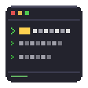

# Command-GUI

**A Fabric client-side mod for Minecraft that lets you execute commands through a clean GUI**

[English](#english) | [中文](#中文)

---

## English

Command-GUI gives you a hotkey-activated overlay to fire off commands without opening chat, manage [Carpet Mod](https://github.com/gnembon/fabric-carpet) fake players, and build reusable command libraries with dynamic placeholders.

### Features

- 🗂 **Custom Commands** — Build a personal library with categories, multi-command chains, and descriptions
- 🔤 **Placeholder System** — Dynamic inputs at runtime: player selector, free text, number, time, coordinates
- 📋 **Preset: Vanilla** — One-click gamemode, time, weather, gamerules, tick control, and more
- 🟩 **Preset: Carpet** — Profile, fake player control, logging, tracking and more
- 🤖 **Fake Player Panel** — Full management: batch spawn, timed spawn/kill, individual actions
- 🔍 **Search** — Filter commands instantly across all categories

### Installation

1. Install [Fabric Loader](https://fabricmc.net/use/installer/) ≥ 0.18.6 and [Fabric API](https://modrinth.com/mod/fabric-api)
2. *(Optional)* Install [Carpet Mod](https://github.com/gnembon/fabric-carpet) for the Fake Player tab
3. Download the latest `command-gui-*.jar` from [Releases](https://github.com/xgenya/command-gui/releases/latest)
4. Drop it into your `.minecraft/mods/` folder
5. Launch Minecraft 1.21.1 with the Fabric profile — press **`C`** to open the GUI

### Documentation

Full documentation is available on the **[Wiki](https://github.com/xgenya/command-gui/wiki)**:

| Page | Topics |
|------|--------|
| [Installation](https://github.com/xgenya/command-gui/wiki/Installation) | Requirements, step-by-step setup |
| [Usage](https://github.com/xgenya/command-gui/wiki/Usage) | Opening the GUI, tabs, keybind |
| [Custom Commands](https://github.com/xgenya/command-gui/wiki/Custom-Commands) | Add, edit, delete, categories |
| [Placeholders](https://github.com/xgenya/command-gui/wiki/Placeholders) | All placeholder types with examples |
| [Fake Player](https://github.com/xgenya/command-gui/wiki/Fake-Player) | Batch spawn, timed tasks, actions |
| [Preset Commands](https://github.com/xgenya/command-gui/wiki/Preset-Commands) | Vanilla & Carpet built-in groups |
| [Settings](https://github.com/xgenya/command-gui/wiki/Settings) | Tab visibility settings |
| [Configuration](https://github.com/xgenya/command-gui/wiki/Configuration) | JSON config file reference |
| [Development](https://github.com/xgenya/command-gui/wiki/Development) | Build, structure, extending the mod |

---

## 中文

Command-GUI 为你提供一个快捷键唤出的命令覆盖层，无需打开聊天框即可执行命令，支持 [Carpet Mod](https://github.com/gnembon/fabric-carpet) 假人管理，以及带动态占位符的可复用命令库。

### 功能

- 🗂 **自定义指令** — 建立个人命令库，支持分类、多命令链和描述
- 🔤 **占位符系统** — 运行时动态输入：玩家选择、自由文本、数字、时间、坐标
- 📋 **预设：原版** — 一键切换游戏模式、时间、天气、游戏规则、tick 控制等
- 🟩 **预设：Carpet** — 性能分析、假人控制、日志、追踪等
- 🤖 **假人管理面板** — 批量生成、定时生成/移除、单独控制
- 🔍 **搜索** — 跨所有分类即时过滤指令

### 安装

1. 安装 [Fabric Loader](https://fabricmc.net/use/installer/) ≥ 0.18.6 和 [Fabric API](https://modrinth.com/mod/fabric-api)
2. *（可选）* 安装 [Carpet Mod](https://github.com/gnembon/fabric-carpet) 以使用假人标签页
3. 从 [Releases](https://github.com/xgenya/command-gui/releases/latest) 下载最新的 `command-gui-*.jar`
4. 将其放入 `.minecraft/mods/` 文件夹
5. 使用 Fabric 配置文件启动 Minecraft 1.21.1 — 按 **`C`** 打开界面

### 文档

完整文档请访问 **[Wiki](https://github.com/xgenya/command-gui/wiki)**：

| 页面 | 内容 |
|------|------|
| [安装](https://github.com/xgenya/command-gui/wiki/Installation) | 依赖要求，安装步骤 |
| [使用方法](https://github.com/xgenya/command-gui/wiki/Usage) | 打开界面、标签页、快捷键 |
| [自定义指令](https://github.com/xgenya/command-gui/wiki/Custom-Commands) | 添加、编辑、删除、分类 |
| [占位符](https://github.com/xgenya/command-gui/wiki/Placeholders) | 所有占位符类型及示例 |
| [假人管理](https://github.com/xgenya/command-gui/wiki/Fake-Player) | 批量生成、定时任务、单独操作 |
| [预设指令](https://github.com/xgenya/command-gui/wiki/Preset-Commands) | 原版 & Carpet 内置命令组 |
| [设置](https://github.com/xgenya/command-gui/wiki/Settings) | 标签页显示设置 |
| [配置文件](https://github.com/xgenya/command-gui/wiki/Configuration) | JSON 配置文件参考 |
| [开发](https://github.com/xgenya/command-gui/wiki/Development) | 构建、项目结构、扩展模组 |

---

## License / 许可证

[GPL-3.0](LICENSE)
